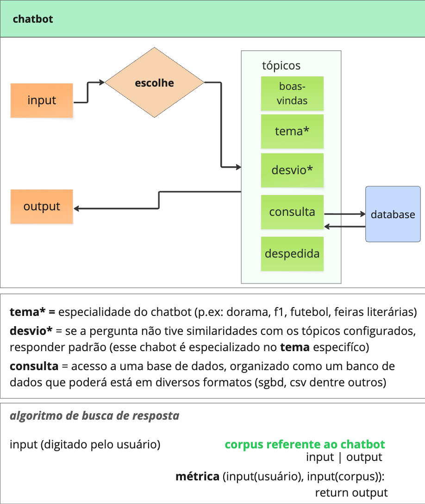

# 🏁 BotF1 - Assistente Inteligente de Fórmula 1

[](https://www.python.org/)
[](https://share.streamlit.io/)
[](https://opensource.org/licenses/MIT)

O **BotF1** é um chatbot inteligente e um dashboard interativo desenvolvido para entusiastas da Fórmula 1. Ele utiliza processamento de linguagem natural (NLP) no ambiente local para detectar a intenção do usuário e integra a API de inferência de altíssima velocidade do **Groq** (usando o modelo `llama-3.1-8b-instant`) com uma base de dados local em formato CSV para responder a perguntas de forma precisa e contextualizada.

Este projeto foi reestruturado de forma modular e elegante para servir de portfólio acadêmico e profissional (LinkedIn e GitHub).

---

## 🚀 Demonstração Visual & Funcionalidades

O aplicativo web é dividido em duas seções interativas principais:
1. **💬 Chatbot F1**: Um chat em tempo real estilizado no tema automobilístico. A cada pergunta, o sistema analisa a intenção da mensagem e retorna a resposta gerada pela IA, destacando o *grau de certeza* e qual *intenção* foi mapeada localmente.
2. **📊 Classificação & Gráficos**: Exibição da tabela dinâmica com a pontuação dos pilotos em 2024 (lida diretamente do arquivo CSV) e um gráfico interativo comparativo de desempenho por equipe.

---

## 📐 Arquitetura do Sistema (Requisitos do Projeto)

O projeto segue fielmente o modelo de arquitetura de chatbot especificado:

<p align="center">
  
</p>

### Descrição dos Componentes e Fluxo:
*   **Tema (`tema*`)**: Configurado para a especialidade de **Fórmula 1 (F1)**. O corpus local e a parametrização do modelo LLM guiam o bot a responder exclusivamente sobre este tema.
*   **Desvio (`desvio*`)**: Caso a pergunta do usuário não atinja a similaridade mínima (35%) com nenhum dos padrões cadastrados no corpus, a mensagem é classificada como `desvio`, ativando uma resposta padrão restritiva ("Esse chatbot é especializado em Fórmula 1...").
*   **Consulta (`consulta`)**: Mapeado na intenção `consulta_csv`. Faz a interface direta com a base de dados (`data/pilotos_f1_2024.csv`) e enriquece a resposta com os dados extraídos do CSV.
*   **Boas-vindas e Despedida**: Fluxos de entrada e saída mapeados no corpus para recepção e finalização amigável de sessão.
*   **Algoritmo de Busca de Resposta**: Implementado localmente através de funções de similaridade de texto no arquivo `src/nlp.py`.

---

## 🛠️ Arquitetura e Engenharia do Projeto

O chatbot combina duas camadas de inteligência:

### 1. Detecção Local de Intenções (NLP Híbrido)
Antes de enviar a pergunta para o modelo de linguagem (LLM), o sistema roda um algoritmo de NLP local que calcula a similaridade do texto do usuário com um conjunto de padrões cadastrados. A similaridade é calculada usando uma **média ponderada** de duas métricas clássicas:
*   **Similaridade de Levenshtein**: Analisa a distância de edição entre os caracteres. Excelente para lidar com erros de digitação comuns ou pequenas variações gramaticais.
*   **Similaridade de Cosseno (Bag of Words)**: Converte as strings em vetores de frequência de palavras e calcula o cosseno do ângulo entre eles. Ótimo para entender o contexto com base nas palavras-chave contidas na frase.

Se o score combinado ultrapassar o limiar de aceitação (35%), a intenção é classificada (ex: `consulta_csv`, `piloto`, `equipe`, `campeonato`). Caso contrário, é classificada como `desvio` (assuntos fora do escopo de F1, impedindo alucinações da IA).

### 2. Integração de Base de Dados Local (RAG Simplificado)
Se a intenção do usuário for de consulta (`consulta_csv`), o sistema lê dinamicamente a base de dados (`data/pilotos_f1_2024.csv`) usando o `pandas`, mapeia o piloto em questão e injeta esses dados reais diretamente no *System Prompt* enviado ao Llama 3 no Groq. Isso garante respostas sempre exatas e atualizadas com base nos dados do arquivo.

---

## 📁 Estrutura de Pastas Organizada

A estrutura segue o padrão de design modular do ecossistema Python:

```text
projeto-chatbot-unicarioca/
│
├── data/
│   └── pilotos_f1_2024.csv  # Base de dados oficial do campeonato de 2024
│
├── notebooks/
│   └── chatbot.ipynb        # Jupyter Notebook com os testes e prototipagem iniciais
│
├── src/                     # Código-fonte da lógica da aplicação (Modular)
│   ├── __init__.py          # Inicializador do pacote python
│   ├── database.py          # Leitura de dados e consulta dinâmica no CSV
│   ├── llm.py               # Integração com a API do Groq (Llama-3)
│   └── nlp.py               # Lógica matemática e dicionário de intenções
│
├── .gitignore               # Ignora arquivos de credenciais e caches locais
├── app.py                   # Ponto de entrada do painel web Streamlit
├── requirements.txt         # Lista de dependências do projeto
└── README.md                # Esta documentação do projeto
```

---

## 💻 Instalação e Execução Local

Siga o passo a passo para rodar o projeto no seu computador:

### Prerrequisitos
*   Python 3.8 ou superior instalado.
*   Uma chave de API da [Groq Console](https://console.groq.com/) (Gratuita).

### Passo 1: Clonar o Repositório
```bash
git clone https://github.com/SEU_USUARIO/projeto-chatbot-unicarioca.git
cd projeto-chatbot-unicarioca
```

### Passo 2: Criar e Ativar o Ambiente Virtual
No terminal (Windows PowerShell):
```powershell
python -m venv .venv
.venv\Scripts\Activate.ps1
```
No Linux/macOS:
```bash
python3 -m venv .venv
source .venv/bin/activate
```

### Passo 3: Instalar as Dependências
```bash
pip install -r requirements.txt
```

### Passo 4: Configurar as Variáveis de Ambiente (Opcional)
Crie um arquivo `.env` na raiz do projeto e insira sua chave do Groq:
```env
GROQ_API_KEY=gsk_suachaveaqui...
```
*(Nota: Se preferir, você poderá colar a chave diretamente na barra lateral da página do Streamlit durante a execução).*

### Passo 5: Executar o Aplicativo
```bash
streamlit run app.py
```
O Streamlit abrirá uma aba no seu navegador padrão no endereço `http://localhost:8501`.

---

## 🌐 Deploy no Streamlit Cloud

Para colocar o projeto online e compartilhar no LinkedIn:
1. Suba este repositório no seu GitHub pessoal.
2. Acesse o [Streamlit Community Cloud](https://share.streamlit.io/) e faça login com sua conta do GitHub.
3. Clique em **"New App"** e selecione o repositório, a branch (ex: `main`) e o arquivo principal `app.py`.
4. Em **"Advanced settings"**, adicione sua chave do Groq na caixa de secrets:
   ```toml
   GROQ_API_KEY = "gsk_suachaveaqui..."
   ```
5. Clique em **"Deploy"**! Sua aplicação estará disponível na web para qualquer um testar.

---

## ✒️ Autores

*   **Desenvolvedor** - [Seu Nome](https://www.linkedin.com/in/seu-perfil/)
*   Projeto acadêmico para fins de demonstração da disciplina de IA / NLP na **UniCarioca**.
